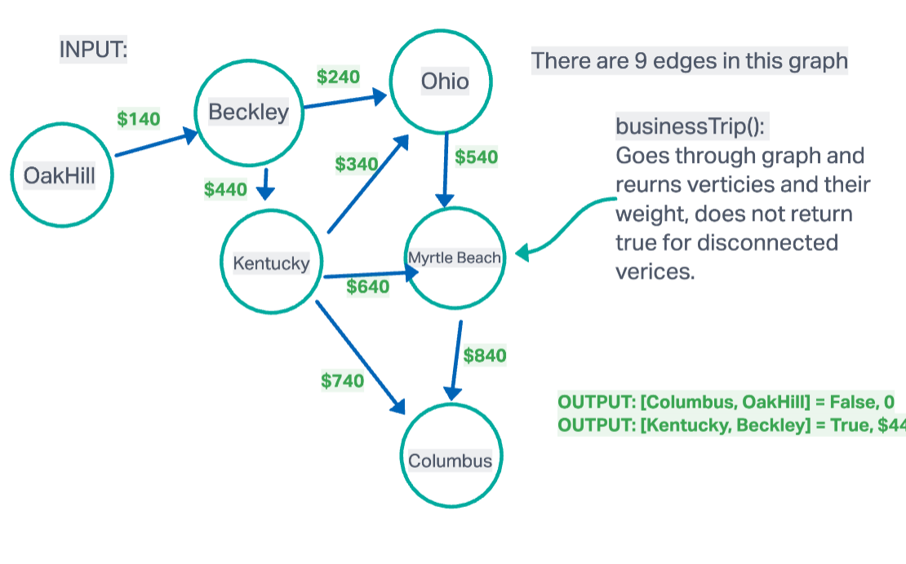

# Graph

A database that uses graph structures for semantic queries with nodes, edges, and properties to represent and store data.

## Challenge
Create a breadFirst method for the Graph class that takes in a Vertex and returns a collection of vertices in the order they were visited.

## Approach & Efficiency

The efficiency for the Graph has an O(n) depending on its vertex's root. The space is O(n) with a created set that contains all respective nodes visited. 

## Whiteboard 

- BreadthFirst()

- BusinessTrip()

## API

| Method    | Argument | Graph                                                                                                 |
|-----------|----------|--------------------------------------------------------------------------------------------------------------|
| addNode()  | N/A      | Add a node to the graph                                                           |
| addEdge()   | N/A      | Adds a new edge between two nodes in the graph                                                                 |
| getNodes) | N/A      | Returns all of the nodes in the graph as a collection (set, list, or similar) |
| getNeighbors() | N/A  | Returns a collection of edges connected to the given node|
| size() | N/A | Returns the total number of nodes in the graph |
| breadFirst() | N/A | Returns a collection of nodes in the order they were visited. |
| breadFirst() | graph, array of city names | Returns Return: cost or null; Determine whether the trip is possible with direct flights, and how much it would cost. |

### Contributors:  Chattray Chea
