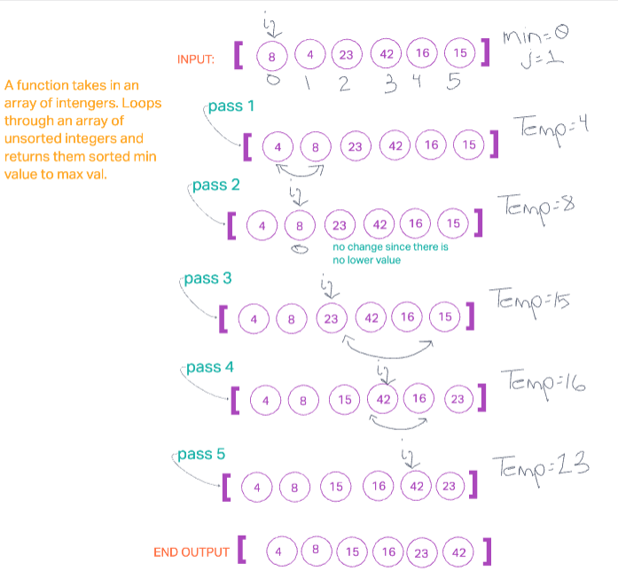

## Insertion Sort

Insertion Sort is a sorting algorithm that traverses through the array, checking the `current` index of the array against a `temporary` variable to see which is less than the other. The minimum number is then placed at the beginning of the array and the loop starts over at the previous index and executes that code until the array has been completely sorted.

The process of creating the function is by passing in an unsorted array, the code block within the function executes a **for loop** that has a nested **while loop**, allowing iteration through the length of the array that sets respective indexed values to a temporary variable and decrementing the previous index to create a stopping point, at which the sorted array is returned.

This sorting algorithm has a time of O(n^2), meaning that this is best used for inputs that are sorted pretty close to the desired output initially.

