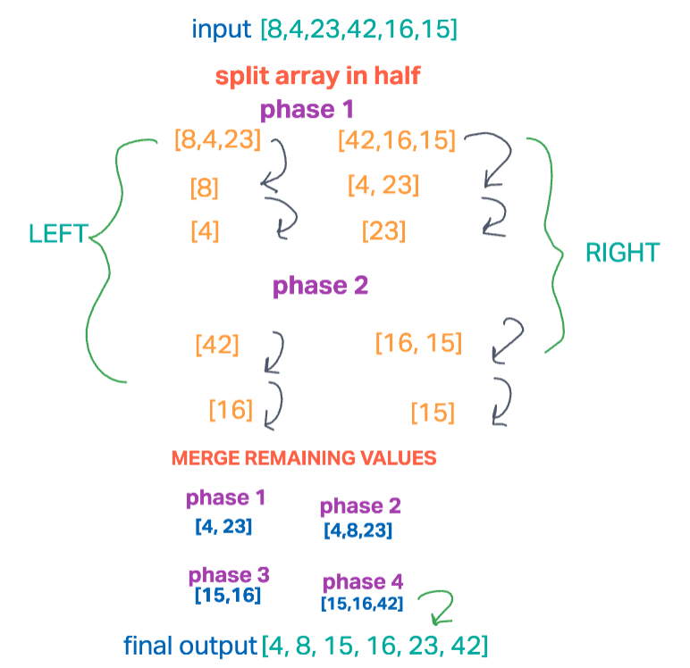

# Merge Sort

Two functions are created to sort through an array recursively. If an array has a length of 1 index or less, the array is returned as the final output.  The first function `mergeSort` splits the array in half and then invoke the `merge` function on the left and right half. 

As it goes through each data in our array, splitting and invoking respective functions based on the current case, the array is being sorted and re-split. Each half of the array will reach a point of having the length of 1 and be pushed onto an empty array which creates the final output of a sorted array. 

Being as though the values are being stored in their own arrays, the space is O(n), taking up only half of the size of the initial input.

## Whiteboard

