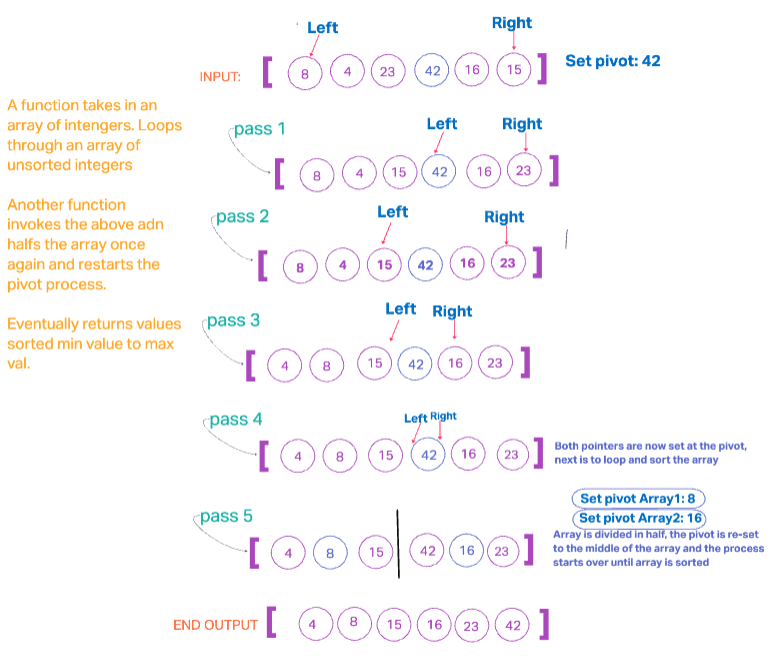

# Quick Sort 

An array calls a recursive function (`quickSort()`, `pivot()`)that sorts through values based on the respective conditional and then divides the array into a smaller portion that will be sorted through next. A value is designated as the pivot value, that of which other values will be compared against the current pivot value and placed to the left or right, dependent on if it is larger or smaller that the pivot value. This happens on both the left and right sides of the designated pivot value, covering the entire length of the array and returning an output of the arrays values in descending order.

For better time the middle value is chosen so that the full length of the array does not need to be searched through in order to search the array.

## WhiteBoard 

